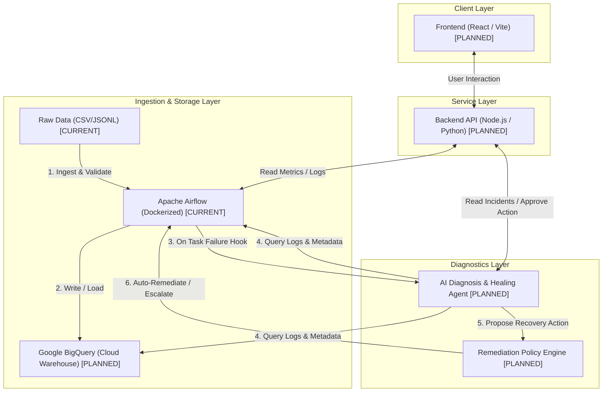

# System Architecture — Self-Healing Data Pipeline

This document details the high-level architecture, component responsibilities, and implementation roadmap of the Self-Healing Data Pipeline project.

---

## 1. System Topology

The diagram below outlines the flow of data, control, and diagnostics across the system:

---

## 2. Component Directory

| Component | Responsibility | Status |
| :--- | :--- | :--- |
| **Frontend** | Visual dashboard for monitoring pipeline health, viewing logs, showing active incident reports generated by the agent, and reviewing/approving escalations. | **PLANNED** |
| **Backend API** | Exposes REST endpoints to bridge the Frontend, Airflow, and the Agent. Serves pipeline metrics, runs incident history, and handles approval requests. | **PLANNED** |
| **Airflow Orchestrator** | Coordinates task execution, retries, and data lineage. Staging ingestion tasks read raw files, execute quality checks, load data into BigQuery, and trigger the agent hook on failure. | **CURRENT** (Restructured / Skeleton DAG staged) |
| **AI Agent** | Autonomous diagnostic engine triggered on task failures. Gathers evidence from Airflow logs and BigQuery metadata, diagnoses the root cause, and generates reports. | **PLANNED** |
| **Policy Engine** | Gatekeeper that validates the AI Agent's proposed actions against static safety rules, executing safe fixes automatically or escalating to a human. | **PLANNED** |
| **Google BigQuery** | Target cloud data warehouse. Hosts raw staging schemas, dimensions (`dim_customers`, `dim_products`), and partitioned/clustered facts (`fct_orders`, `fct_events`). | **PLANNED** (GCP Setup stage) |
| **Infrastructure** | Containerized execution environment using Docker Desktop + WSL2 to run Airflow scheduler, webserver, init container, and PostgreSQL metadata database locally. | **CURRENT** (Restructured & Ready) |

---

## 3. Development Phases

### Phase 0 & 1 — Setup (Complete)
- Initial WSL2 and Ubuntu installation verified.
- Docker Desktop setup and verified on the host system.
- Raw CSV/JSONL datasets inspected and validated.

### Phase 2B — Architecture Restructuring (Current)
- Monorepo directory structure created.
- File assets moved into structured domains (apps, airflow, infrastructure, data, tests, scripts, docs).
- Docker Compose volume mounts updated and validated.
- `.gitignore` and `.env.example` added for git safety.

### Phase 2C — Core ETL Pipeline (Planned - Next)
- Build the clean Airflow ETL pipeline.
- Implement staging tables and BigQuery loads.
- Write schema validation and quality verification logic matching the thresholds in `pipeline_config.yaml`.

### Phase 3 — AI Agent & Diagnostics (Future)
- Design and integrate the AI diagnostic agent.
- Implement tool-calling capabilities (Airflow logs, BigQuery metadata, DB state).
- Build the Policy Engine for safe auto-remediations.

### Phase 4 — Frontend & API (Future)
- Build the Node.js/Python Backend API.
- Build the interactive web frontend dashboard.
- Integrate human-in-the-loop approval workflows for escalations.
