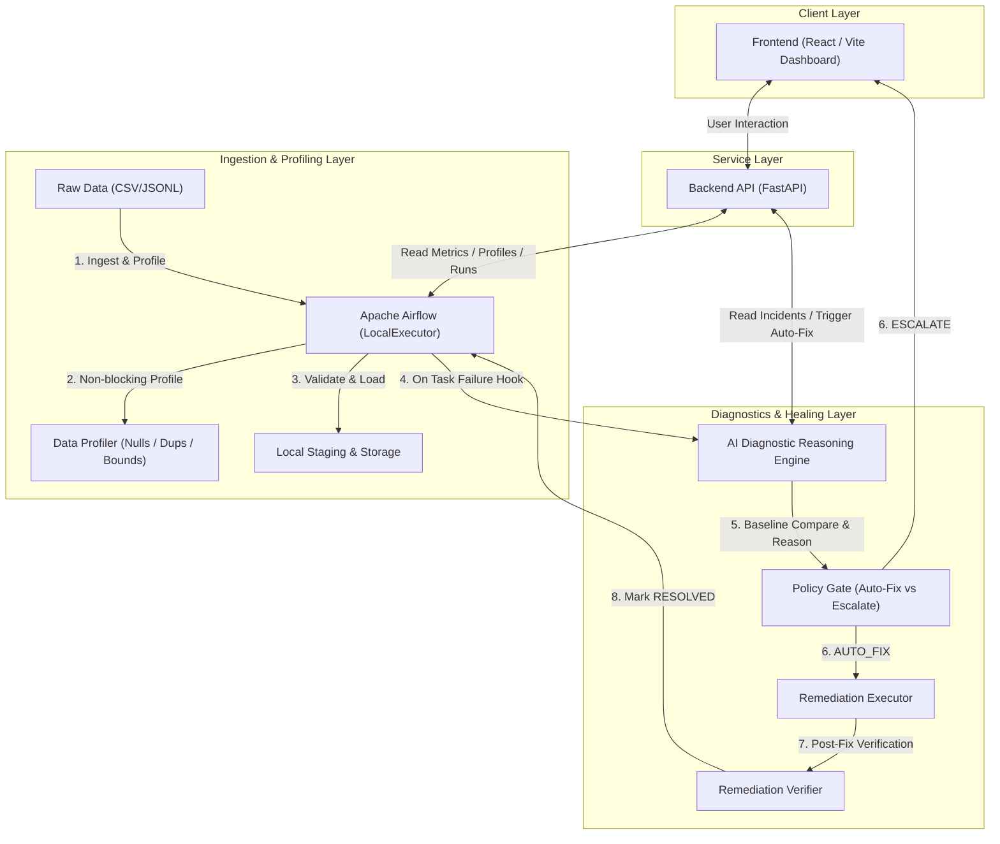

# System Architecture — Self-Healing Data Pipeline

This document details the high-level architecture, component responsibilities, data profiling, incident lifecycle, policy gate, and implementation topology of the Self-Healing Data Pipeline project.

---

## 1. System Topology

The diagram below outlines the flow of data, control, profiling, and diagnostics across the system:



---

## 2. Component Directory

| Component | Responsibility | Status |
| :--- | :--- | :--- |
| **Frontend** | Interactive React/Vite dashboard displaying Live Pipeline Flow, DAG Node Canvas, Telemetry Metrics, Data Profiling, and Incident Inspector. | **COMPLETE** |
| **Backend API** | FastAPI service exposing REST endpoints for pipeline status, summary runs, incident listings, profiling reports, fault injection, and remediation calls. | **COMPLETE** |
| **Airflow Orchestrator** | Coordinates 5 TaskGroups (`ingestion`, `validation`, `transformation`, `load`, `monitoring`) and 8 tasks with detailed `doc_md` documentation and failure callbacks. | **COMPLETE** |
| **Data Profiler** | Non-blocking data health calculator evaluating row counts, null %, duplicate %, min/max bounds, column distributions, and freshness SLAs. | **COMPLETE** |
| **AI Diagnostic Engine** | Structured reasoning engine processing anomalies (`OBSERVED → EVIDENCE → POSSIBLE ROOT CAUSES → CONFIDENCE → BLAST RADIUS → RECOMMENDED ACTION`). | **COMPLETE** |
| **Policy Gate** | Safeguard engine enforcing `AUTO_FIX` for low-risk idempotent actions vs `ESCALATE` for high-risk anomalies (`SCHEMA_DRIFT`, `NULL_SPIKE`, `REFERENTIAL_BREAK`). | **COMPLETE** |
| **Remediation & Verifier** | Executes deterministic deduplication / quarantine actions followed by post-fix verification assertions before marking incidents `RESOLVED`. | **COMPLETE** |

---

## 3. Incident Lifecycle

```
DETECTED (Validation Assert Failure)
   ↓
SERIALIZED (Incident Report JSON & Markdown Created)
   ↓
DIAGNOSED (AI Engine & Historical Baseline Comparison)
   ↓
POLICY GATE EVALUATION
   ├── LOW-RISK (DUPLICATE / STALENESS) → AUTO_FIX → REMEDIATION → VERIFICATION → RESOLVED
   └── HIGH-RISK (SCHEMA / NULL / REF / DROP) → ESCALATE → HUMAN REVIEW → RESOLVED
```
